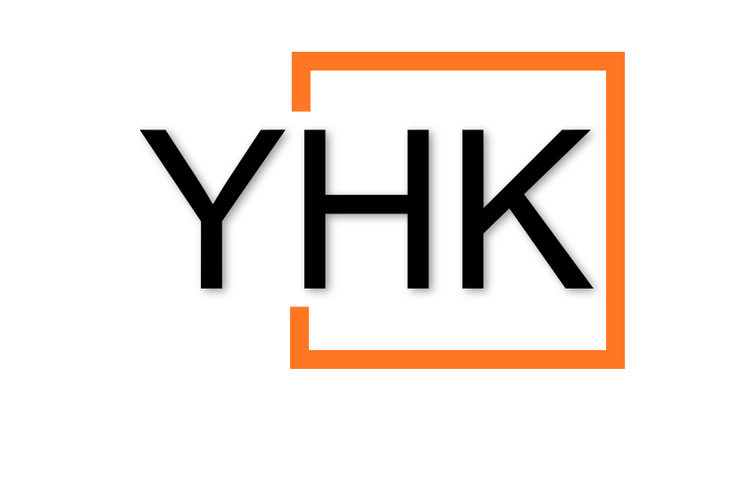

# AI Coaching


## Elevator Pitch
ChatGPT prompt:

```
Generate a 30 second elevator pitch using the description of my company (or career) below. The pitch should be brief, punchy, and compelling. 
I have started an individual AI Coaching business, where I can be a sounding board to CXOs, do mentoring of teams, plan roadmap, help in hiring, participate in brain-storming, etc. I would prefer a retainership model where I will work for say 2 to 3 hrs a week and charge monthly fees, with the total contract at least for a year. Please note that I won't be able to participate in doing demos for customers, hands-on deliverables, etc. I am not comfortable for the client showing myself as employee for funding or otherwise, asking me to post for LinkedIn reach, etc”
```

Response:
```
Attention all CXOs and team leaders! Are you struggling to keep up with the ever-evolving world of AI? Look no further than my individual AI coaching business. As your personal sounding board, I offer mentoring, roadmap planning, team hiring, and brainstorming sessions to help you navigate the world of AI. With a retainer model that allows me to work just 2-3 hours per week, I can provide you with the guidance you need without breaking the bank. And with a minimum contract length of one year, you can trust that I am committed to your success. Please note that I cannot participate in demos or hands-on deliverables, nor can I be presented as an employee for funding or LinkedIn posts. Let's work together to unlock your AI potential!
```


## FAQs
- Which clauses should be considered while drafting an AI Coaching Retainership contract?
	When drafting an AI coaching retainership contract, there are several important clauses to consider. Here are some key aspects to include in the contract:


	* Scope of Work: Clearly define the scope of work and the specific coaching services to be provided. Outline the objectives, goals, and expected deliverables in detail. This ensures both parties have a clear understanding of the services to be rendered.
	* Payment Terms: Specify the fees, payment schedule, and invoicing details. Outline whether the fees are fixed or variable based on certain milestones or deliverables. Include provisions for late payment, early termination, and any additional expenses that may be incurred.
	* Data Privacy and Confidentiality: Address the handling of data and the importance of maintaining client confidentiality. Include clauses that require the coach to keep all client information confidential and secure, and outline how the data will be handled, stored, and protected in compliance with applicable laws and regulations.
	* Non-Disclosure Agreement (NDA): If confidential or proprietary information will be shared between the parties, include an NDA clause to protect sensitive information. Specify what constitutes confidential information, the obligations of the parties to maintain confidentiality, and the duration of the NDA.
	* Intellectual Property: Define ownership and usage rights of any intellectual property developed during the coaching engagement. Clarify whether the coach retains any rights to use the methodologies, frameworks, or materials developed during the coaching process.
	* Term and Termination: Define the duration of the coaching retainership, including the start and end dates. Specify the conditions under which either party can terminate the contract, such as non-performance, breach of contract, or mutual agreement. Outline the notice period required for termination.
	* Freedom to Take Up Other Assignments: If the coach wishes to have the freedom to take up other assignments concurrently, address this in the contract. Clearly state any limitations or conflicts of interest that may arise and how they will be managed.
	* Dispute Resolution: Include a clause that outlines the process for resolving disputes, such as mediation or arbitration, and specify the governing law under which the contract will be interpreted.
	* Liability and Indemnification: Allocate responsibility for any damages, losses, or claims that may arise during the coaching engagement. Limit the liability of both parties to the extent permitted by law and include an indemnification clause to protect each party from claims resulting from the other party's actions or omissions.
	* Governing Law and Jurisdiction: Specify the governing law and jurisdiction that will apply to the contract. This helps establish the legal framework under which any disputes will be resolved.


- Should I get a new domain, email, website hosting?
	* Pros: gives credibility to the enterprise, easier to get into contracts, formally
	* Cons: website maintenance, cost, cheating by GoDaddy, may have to cancel if unused
	* Decision: Better to stay without these, as I have LinkedIn profile and yahoo email on the visiting cards anyways. It's good to be under the radar so that you can switch easily.


- Should I apply for a new GSTN?
	* Pros: a must for formal consultancy roles. Can save a lot on taxes as its deductible.
	* Cons: monthly submission will be 3k/m, about 40k per year for compliance. May or may not get that work.
	* Decision: Go for it only when some formal offer comes, else NO.


- How much should I charge
	* No hourly rate like for any hands-on work, but Retainer model for Advisory roles, monthly flat fee and cap on hours.
	<!-- * 5 years back it was 6k/hr for training + GST, now it has to be 10k/hr as bare minimum, that's $120. For 4 hrs/wk, ie 16 hrs a month, approx 20 hrs, 2L/month, 50k variable ok.
	* For any fully foreign engagements, go for $250 i.e. 20k/hr, else FREE. 4L/m +GST -->

- AI Coaching, What's-in, What's-Out?
	* In: Sounding board, mentoring, roadmap, hiring, brain-storming
	* Out: Doing demos for customer, hands-on deliverables, showing myself as employee for funding or otherwise, asking me to post for LinkedIn reach
	* Conflict of Interest: I am working on the same technologies AI/ML/NLP/ChatGPT, so I won't mention anything about specific projects I am doing with clients, but I should be free to write about generic things.

- What’s the Logo?
	YHK with Y out of the box. Lettering is in “Calibri (Body)” 54 font. An broken rectangle is of 2.6cm height and 4cm width with thickness as 4.5, Saffron color is HEX #FF7722 / RGB (255, 119, 34)


  