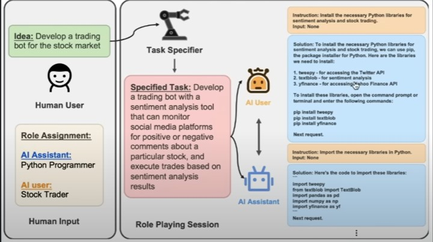

# Agents

## PoCs
- [Transformers Agent](https://colab.research.google.com/drive/1HGpp1OI-o_ppHi2bHZsvV6QX9k5gsTIK?usp=sharing) - Various tools for Langchain Agents. Is this Hugging Face's Transformers LangChain Competitor? Sam Witteveen

- [Camel Agent](https://colab.research.google.com/drive/1nEHFgsbl9ZJ97SdIjXZUL8S0TRR3AoFo?usp=sharing) - [video](https://www.youtube.com/watch?v=JA4ivRJqqt4) - CAMEL: Communicative Agents for “Mind” Exploration of Large Scale Language Model Society
	```
	# Setup roles and task for role-playing
	assistant_role_name = "Python Programmer"
	user_role_name = "Stock Trader"
	task = "Develop a trading bot for the stock market"
	word_limit = 50  # word limit for task brainstorming
	```



