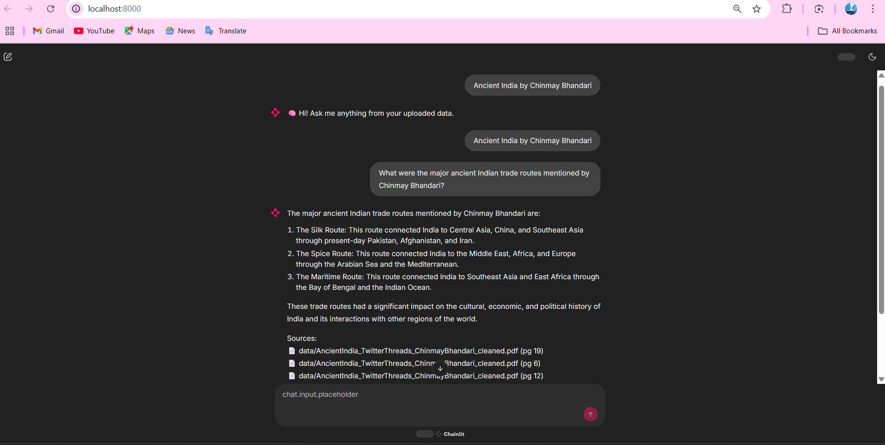

# Ask Bharat (History of Ancient India)

(Based on [this repo](https://github.com/AIAnytime/Llama2-Medical-Chatbot/blob/main/README.md))

Ask Bharat is an interactive chatbot designed to answer questions related to Ancient Indian history. It supports two UIs — a **Streamlit** app (recommended) and a **Chainlit** app — backed by LangChain + FAISS + Groq LLaMA3.

## Features

- Semantic search over PDFs (Ancient India history documents)
- **Streamlit UI** with full conversational memory (multi-turn history)
- **Groq LLaMA3-70b** for fast, high-quality answers (no local GPU needed)
- **Cross-encoder reranking** (`ms-marco-MiniLM-L-6-v2`): FAISS retrieves 10 candidates, reranker selects top 3 by relevance
- **Clickable citation links** (`[1]`, `[2]`, …) anchored to styled reference cards
- **PDF download buttons** on each reference card (opens source PDF at cited page)
- History-augmented retrieval query to resolve pronouns/coreferences across turns
- Chainlit UI also available (Ollama/llama2, local LLM)
- Modular architecture: retriever + reranker + prompt + LLM

## Prerequisites

- Python 3.11+
- Ollama installed (`https://ollama.com`)
- Recommended Python packages:
  - `langchain`
  - `chainlit`
  - `sentence-transformers`
  - `faiss-cpu`
  - `PyPDF2`
  - `python-dotenv`

## Installation

```bash
git clone <repo path>
ask_bharat.git
cd ask_bharat

# (Optional) Create virtual environment
python -m venv venv
source venv/bin/activate  # Windows: venv\Scripts\activate

# Install dependencies
pip install -r requirements.txt
```

## Getting Started

Prepare Vector DB
Ingest your documents using FAISS-based embedding:

```bash
python ingest.py
```

## Set Configuration

Make sure the following are properly configured:

`DB_FAISS_PATH` in your code
`.env` file with any required secrets or keys

## Start Ollama

Load the required LLM (e.g., llama2):

```bash
ollama run llama2
```

## Run the Chatbot

Streamlit UI (recommended — Groq + reranking + citations):

```bash
streamlit run streamlit_main.py --server.fileWatcherType none
```

Chainlit UI (Ollama / local LLM):

```bash
chainlit run chainlit_main.py
```

## Flow

my Query→ Chainlit UI→ retriever from faiss(finds relevant context from pdf)→ prompt(build with user ques+context)→ LLM (llama2 via Ollama) generate full answer→ ans returned to Chainlit

`index.faiss`: stores document embeddings
`index.pkl`: holds metadata like source, page, and original text

Embeddings generated using `sentence-transformers/all-MiniLM-L6-v2`

## Images


<!-- 

 -->
## Docker Support

1. Place your downloaded model in the models/ folder
2. Update the model path in chainlit_main.py (around line 50)

3. Build and run:

```bash
docker build -t bharat .
docker run -p 8000:8080 bharat
```

Visit http://localhost:8000

## Deploy to Cloud Run (Optional)

1. Create a Google Cloud project & enable Cloud Run API
2. Set up Artifact Registry and Docker authentication
   Build and push:

```bash
docker tag bharat <region>-docker.pkg.dev/<project>/<repo>/bharat
docker push <region>-docker.pkg.dev/<project>/<repo>/bharat
```

## Deploy:

```bash
gcloud run deploy bharat \
  --image <region>-docker.pkg.dev/<project-id>/<repo>/bharat
```

Allow unauthenticated access
Select the region and confirm deployment

## Contributing

1. Fork the repo and create a new branch
2. Add your improvements or fixes
3. Make sure code is tested and documented
4. Submit a pull request — all contributions are welcome!

## License

MIT License

## Docs & Support

For more information:
Refer to LangChain Documentation

Happy exploring the history of Ancient India 🇮🇳 with Ask Bharat! 🚀

