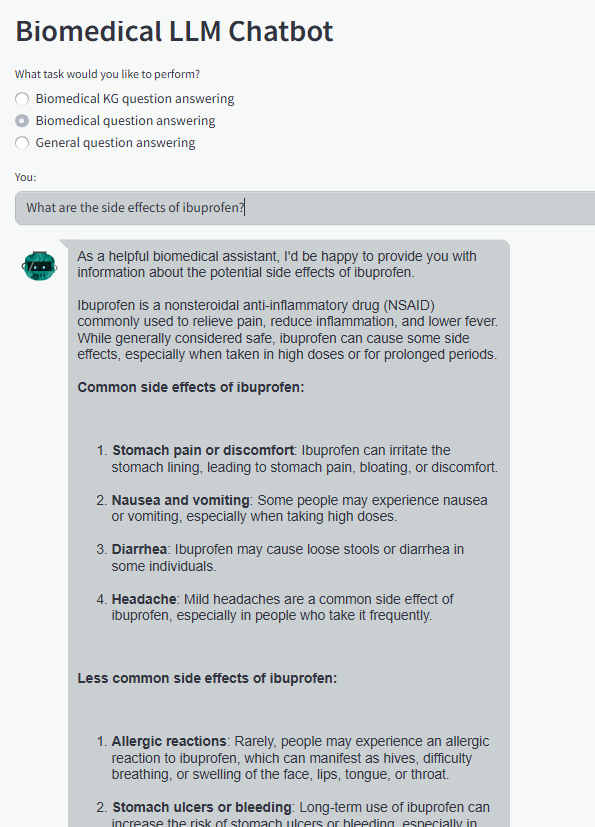

## LLM Chatbot

(Ref: https://github.com/vvrahul11/llm_chatbot)

This is a web application that allows you to interact with GPT, Bio-GPT, and Falcon(7B parameters) models.
Corresponding medium blog post: https://medium.com/towards-artificial-intelligence/using-large-language-models-to-build-a-biomedical-chatbot-and-deploying-it-af7818a0ab7f

### Installation

```bash
# 1. Create virtual environment
conda create -n llm_chatbot python=3.9.7
conda activate llm_chatbot

# 2. Install dependencies
pip install -r requirements.txt

# 3. Setup environment variables
# Create a .env file with the following keys
```

`.env`

```bash
GROQ_API_KEY=your_groq_key
NEO4J_URI=neo4j+s://xxxx.databases.neo4j.io
NEO4J_USERNAME=neo4j
NEO4J_PASSWORD=your_neo4j_password
```

### Core Components

| File               | Description                                                     |
| ------------------ | --------------------------------------------------------------- |
| `falcon.py`        | General-purpose medical Q&A using **Falcon** (via **Groq API**) |
| `biogpt.py`        | Research-grade biomedical Q&A using **BioGPT**                  |
| `gpt.py`           | Knowledge Graph Q&A using **Neo4j + LangChain + GPT**           |
| `streamlit_app.py` | Unified Streamlit interface for model selection and chat        |

- **Multi-Model Chatbot**
- **Neo4j Integration**

### Run

```bash
streamlit run streamlit_app.py
```

### How to use?

- Enter a query in the text box and press enter to receive a response

### Images

<!-- 

 -->

## Extension ideas

1. Chatbot Answering from Your Own Knowledge Base- Langchain, ChatGPT, Pinecone, and Streamlit: https://www.youtube.com/watch?v=nAKhxQ3hcMA&t=342s&ab_channel=PradipNichite
2. Generating Cypher Queries With ChatGPT 4 on Any Graph Schema: https://neo4j.com/developer-blog/generating-cypher-queries-with-chatgpt-4-on-any-graph-schema/:
3. Context-Aware Knowledge Graph Chatbot With GPT-4 and Neo4j: https://neo4j.com/developer-blog/context-aware-knowledge-graph-chatbot-with-gpt-4-and-neo4j/
4. Knowledge Graph-Based Chatbot With GPT-3 and Neo4j: https://neo4j.com/developer-blog/knowledge-graph-based-chatbot-with-gpt-3-and-neo4j/
5. Langchain introduction: https://medium.com/databutton/getting-started-with-langchain-a-powerful-tool-for-working-with-large-language-models-286419ba0842
6. https://medium.com/neo4j/harnessing-large-language-models-with-neo4j-306ccbdd2867
7. https://towardsdatascience.com/large-language-models-in-molecular-biology-9eb6b65d8a30
